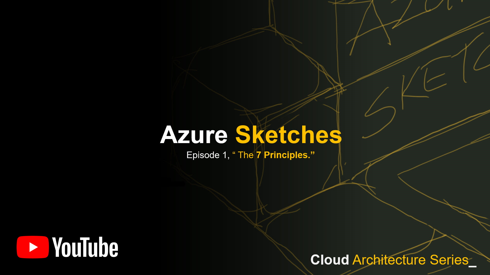
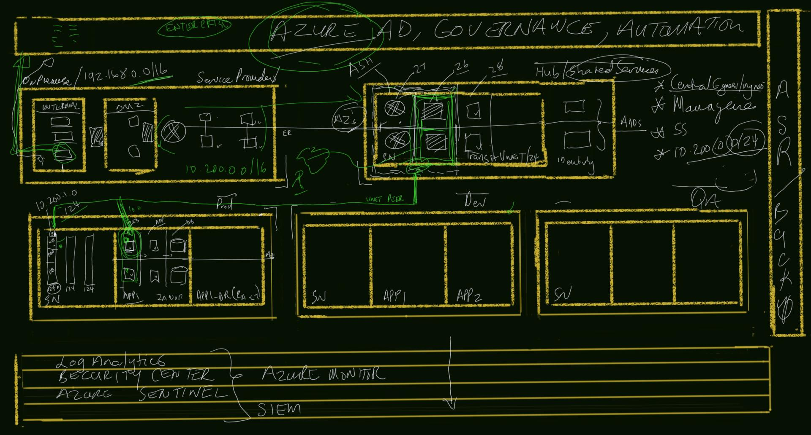

# 26 May 2020

## Join Us

[Azure Sketches, The Architect Series - Part 1](https://www.meetup.com/Azure-Transformation-Labs/events/270689806/) - 26 May 2020 @ 5pm UTC + 2

RSVP on meetup: [Azure Transformation Labs](https://www.meetup.com/Azure-Transformation-Labs/)

## Session notes

Join the Microsoft MVPs at AzureTransform Durban for a very Unique online digital learning experience. "The Azure Sketches, Architect Series", will cover Azure Architecture concepts from Basic to Advanced during a weekly power hour session. The series will use a combination of traditional drawing & sketching with actual solution building to help reinforce the thought process in building Azure solutions and all of the dependencies in between

## Resources

