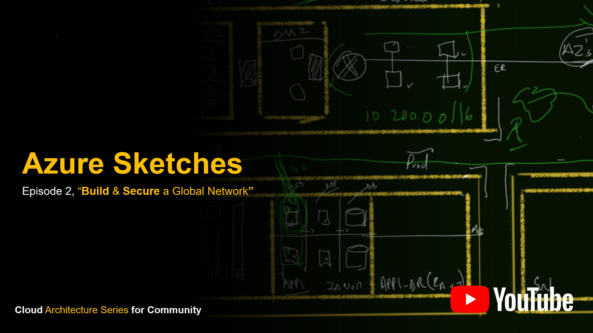
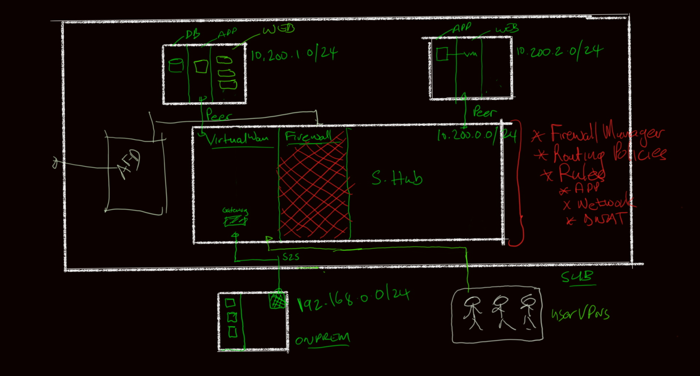

# 23 June 2020 - Azure Sketches, The Architect Series - Part 2

## Join Us

[Azure Sketches, Architecture Series for Community - Part 2](https://www.meetup.com/Azure-Transformation-Labs/events/271102120/) - 23 June 2020 @ 5pm UTC + 2

RSVP on meetup: [Azure Transformation Labs](https://www.meetup.com/Azure-Transformation-Labs/)

## Session notes

Join us for the 2nd installment of the series, where we focus on key cloud architecture challenges, using a combination of demos and sketching for knowledge reinforcement. In this power hour episode, we build a global network using Azure Virtual WAN, Azure Secure Hubs and Azure Firewall Manager connecting multiple sites and virtual networks from different subscriptions. The speed and efficiency of the solution will be demonstrated.

## Resources

