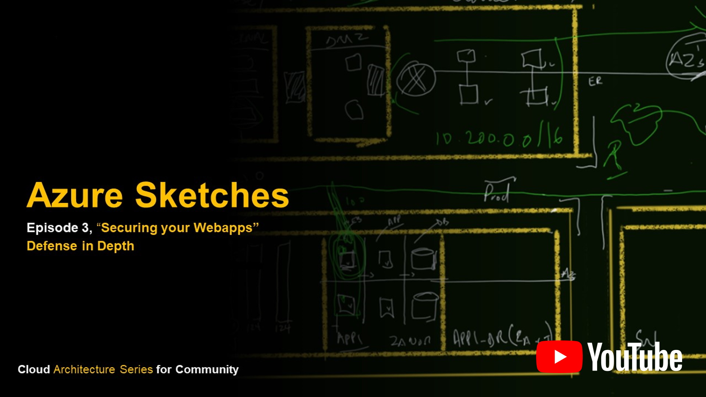
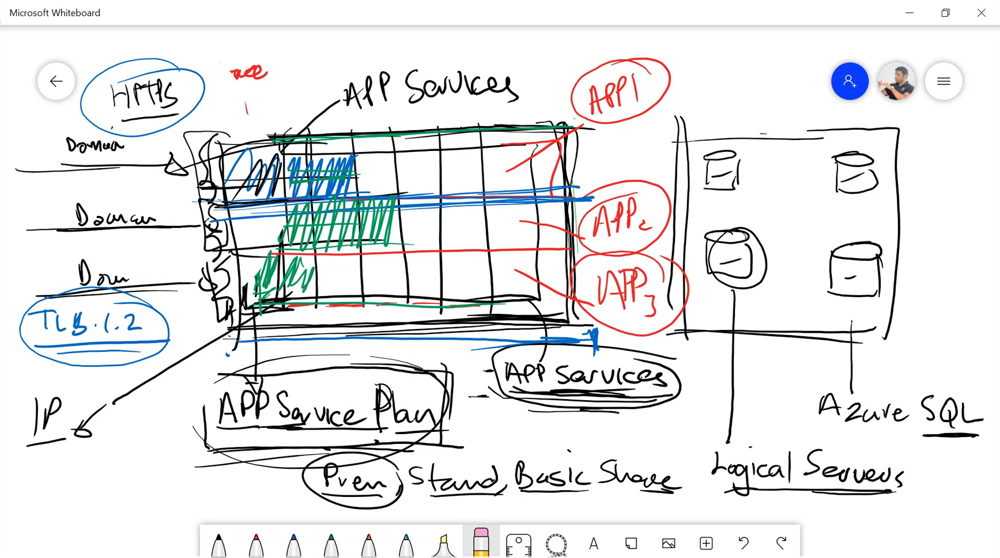

# 21 July 2020 - Azure Sketches, Architecture Series for Community - Part 3

## Join Us

[Azure Sketches, Architecture Series for Community - Part 3](https://www.meetup.com/Azure-Transformation-Labs/events/271857436/) - 21 July 2020 @ 5pm UTC + 2

RSVP on meetup: [Azure Transformation Labs](https://www.meetup.com/Azure-Transformation-Labs/)

## Session notes

Join us again for episode 3. On this episode we focus on how to secure and lock down webapps using a multi-pronged defense strategy that can pass strict auditing and penetration testing.

## Resources

## Subscribe / Join

