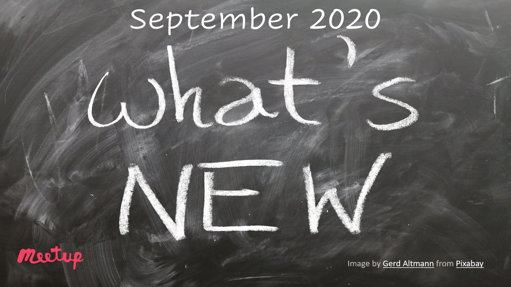

# 1 September 2020 - News & Catch up 📰 September 2020

## Join Us

[News & Catch up September 2020](https://www.meetup.com/Azure-Transformation-Labs/events/272374902/) - 1 September 2020 @ 6pm UTC + 2

RSVP on meetup: [Azure Transformation Labs](https://www.meetup.com/Azure-Transformation-Labs/)

## Session notes

GitHub Demo Days https://resources.github.com/webcasts/Demo-Days-GitHub-Actions-thankyou/

Personal details of 24 million South Africans may have been hacked after attack on credit bureau https://www.intelligentcio.com/africa/2020/08/20/personal-details-of-24-million-south-africans-may-have-been-hacked-after-attack-on-credit-bureau/

Azure DevOps Services is planning a brownout from September 8, 2020 to September 15, 2020 for 2 hours each day to support Service Tags. We apologize for the inconvenience.
https://devblogs.microsoft.com/devops/new-ip-address-ranges-with-service-tags-for-azure-devops-services/

Kafka Summit
https://kafka-summit.org/

A lap around SQL Server 2019 Big Data Cluster
https://derivco.co.za/derivco-webinar-a-lap-around-sql/

Lillian is renowned for building strong, high-performing teams and is passionate about creating diverse and inclusive workplaces.
https://derivco.co.za/webinar-with-lillian-barnard/

In this session, she will unpack data and analytics, and facts around COVID-19, giving you a chance to ask the expert directly. - Professor Quarraisha Abdool Karim
https://derivco.co.za/webinar-with-prof-quarraisha/

GitHub Stars program
https://stars.github.com/

.NET Conf 2020
https://www.dotnetconf.net/
https://www.papercall.io/dotnetconf

Crank is the benchmarking infrastructure used by the .NET team to run benchmarks including (but not limited to) scenarios from the TechEmpower Web Framework Benchmarks.
https://github.com/dotnet/crank

Automatically find latent bugs in your code with .NET 5
https://devblogs.microsoft.com/dotnet/automatically-find-latent-bugs-in-your-code-with-net-5/

Announcing .NET 5.0 Preview 8
https://devblogs.microsoft.com/dotnet/announcing-net-5-0-preview-8/

Migrate apps to Azure Kubernetes Service(AKS)
[Join Preview](https://forms.office.com/Pages/ResponsePage.aspx?id=v4j5cvGGr0GRqy180BHbR2movJJumhJAnlM3ikajletUMldCVTNBMzVCUUVNOEpNWktCUlBKSkdLMS4u)

## Subscribe / Join

